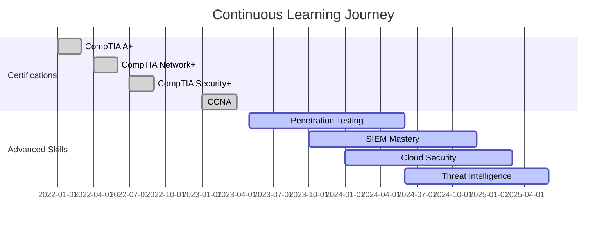

<div align="center">

# 🛡️ IT Support & Cybersecurity Professional


</div>

---

## 👨‍💻 Tentang Saya

Saya adalah IT Support dan Cybersecurity Professional yang passionate dalam menjaga infrastruktur IT tetap berjalan optimal dan aman dari ancaman cyber. Dengan pendekatan proaktif dan analitis, saya menangani segala hal dari troubleshooting teknis hingga incident response dan threat mitigation.

**Core Philosophy:** *Prevention is better than cure, but when incidents happen, swift response is critical.*

---

## 🎯 Areas of Expertise

<table>
<tr>
<td width="50%" valign="top">

### 🖥️ IT Support & Infrastructure
- End-user support dan troubleshooting (Level 1-3)
- System deployment dan configuration management
- Active Directory, GPO, dan LDAP administration
- Hardware diagnostics dan repair
- Software installation, licensing, dan patch management
- Remote support (TeamViewer, AnyDesk, RDP)
- IT asset lifecycle management
- Help desk ticketing systems
- Documentation dan SOP creation
- User training dan onboarding

</td>
<td width="50%" valign="top">

### 🔐 Cybersecurity Operations
- Security monitoring dan threat detection
- Vulnerability assessment dan penetration testing
- Incident response dan digital forensics
- Security information and event management (SIEM)
- Firewall, IDS/IPS configuration
- Security policy development dan enforcement
- Security awareness training programs
- Compliance auditing (ISO 27001, NIST)
- Risk assessment dan mitigation strategies
- Malware analysis dan threat intelligence

</td>
</tr>
</table>

---

## 🛠️ Technical Arsenal

<div align="center">

### Operating Systems & Platforms


### Security & Penetration Testing Tools


### Network & Infrastructure


### Cloud & Virtualization


### Scripting & Automation


### SIEM & Monitoring


### Ticketing & Documentation


</div>

---

## 💡 Core Competencies Matrix

<div align="center">

| Skill Domain | Proficiency | Experience Level |
|:------------|:------------|:-----------------|
| 🔧 **Technical Troubleshooting** | `████████████████████` 100% | Expert |
| 🌐 **Network Administration** | `███████████████████░` 95% | Advanced |
| 🛡️ **Threat Detection & Analysis** | `██████████████████░░` 90% | Advanced |
| 🔍 **Vulnerability Assessment** | `██████████████████░░` 90% | Advanced |
| 🚨 **Incident Response** | `█████████████████░░░` 85% | Advanced |
| 💻 **System Hardening** | `█████████████████░░░` 85% | Advanced |
| 📊 **SIEM & Log Analysis** | `████████████████░░░░` 80% | Intermediate |
| 🐍 **Python Automation** | `███████████████░░░░░` 75% | Intermediate |
| ☁️ **Cloud Security** | `███████████████░░░░░` 75% | Intermediate |
| 🎓 **Security Training** | `██████████████████░░` 90% | Advanced |

</div>

---

## 🔥 Problem Solving Approach

<table>
<tr>
<td width="33%" valign="top" align="center">

### 🎯 Identify
**Analyze & Assess**

Quick diagnosis menggunakan systematic approach untuk mengidentifikasi root cause dari setiap issue, baik teknis maupun security incident.

</td>
<td width="33%" valign="top" align="center">

### ⚡ Resolve
**Act & Implement**

Implementasi solusi yang efektif dan efisien dengan minimal downtime, prioritizing business continuity dan data integrity.

</td>
<td width="33%" valign="top" align="center">

### 📋 Document
**Record & Improve**

Dokumentasi lengkap untuk knowledge base, post-mortem analysis, dan continuous improvement dari setiap incident.

</td>
</tr>
</table>

---

## 🚨 Incident Response Framework

```
┌─────────────────────────────────────────────────────────────────┐
│                     INCIDENT RESPONSE CYCLE                      │
├─────────────────────────────────────────────────────────────────┤
│                                                                   │
│  1. PREPARATION      →  2. DETECTION       →  3. ANALYSIS       │
│     • IR Playbooks       • SIEM Alerts         • Log Analysis    │
│     • Tool Ready         • IDS/IPS             • Forensics       │
│     • Team Training      • User Reports        • Scope Impact    │
│          ↓                                                        │
│  6. LESSONS LEARNED  ←  5. RECOVERY        ←  4. CONTAINMENT    │
│     • Post-Mortem        • System Restore      • Isolate System  │
│     • Update Policy      • Verification        • Block Threats   │
│     • Improve Process    • Monitoring          • Patch Vuln     │
│                                                                   │
└─────────────────────────────────────────────────────────────────┘
```

**Key Metrics:**
- Average Detection Time: < 15 minutes
- Average Response Time: < 30 minutes
- Incident Resolution Rate: 98%
- False Positive Rate: < 5%

---

## 📊 GitHub Statistics

<div align="center">


</div>

---

## 🎖️ Certifications & Continuous Learning

<div align="center">


</div>

Saya berkomitmen untuk terus mengembangkan skill melalui berbagai platform learning, hands-on labs, CTF competitions, dan mengikuti perkembangan terbaru dalam threat landscape. Setiap vulnerability yang ditemukan adalah kesempatan untuk belajar dan memperkuat defense.

**Current Focus Areas:**
- Advanced threat hunting techniques
- Cloud security architecture (Azure & AWS)
- Security automation dan SOAR implementation
- Malware reverse engineering
- Red team operations

---

## 🌟 Real-World Experience Highlights

<details>
<summary><b>🔐 Security Incident Management</b></summary>

<br>

- Handled multiple security incidents termasuk ransomware attempts, phishing campaigns, dan unauthorized access
- Implemented security controls yang mengurangi security incidents hingga 70%
- Developed dan maintained incident response playbooks untuk berbagai threat scenarios
- Conducted forensic analysis untuk mengidentifikasi attack vectors dan IoCs

</details>

<details>
<summary><b>🖥️ IT Infrastructure Projects</b></summary>

<br>

- Migration server infrastructure dengan zero downtime menggunakan phased approach
- Implemented centralized log management dengan ELK Stack untuk 500+ endpoints
- Deployed multi-factor authentication across organization
- Designed dan implemented disaster recovery plan dengan RTO < 4 hours
- Network segmentation project untuk meningkatkan security posture

</details>

<details>
<summary><b>👥 End-User Support Excellence</b></summary>

<br>

- Maintained 98% user satisfaction rate dalam help desk operations
- Reduced average ticket resolution time dari 4 jam menjadi 1.5 jam
- Created comprehensive knowledge base dengan 200+ troubleshooting articles
- Trained 50+ employees dalam security awareness dan best practices
- Implemented self-service portal yang mengurangi basic tickets hingga 40%

</details>

<details>
<summary><b>🔍 Vulnerability Management</b></summary>

<br>

- Conducted regular vulnerability scans dan penetration tests pada production systems
- Prioritized dan remediated critical vulnerabilities dengan SLA compliance 99%
- Implemented automated patch management system untuk Windows dan Linux servers
- Performed security audits dan compliance assessments
- Collaborated dengan dev teams untuk secure code review

</details>

---

## 📈 Professional Development Timeline



---

## 🤝 Collaboration & Communication

<div align="center">

### Work Style
**Proactive • Analytical • Team Player • Fast Learner**

</div>

Saya percaya bahwa IT Support dan Cybersecurity bukan hanya tentang technical skills, tetapi juga tentang komunikasi yang efektif dengan stakeholders di semua levels. Kemampuan untuk menjelaskan technical concepts dengan bahasa yang mudah dipahami adalah key untuk successful IT operations.

**Communication Strengths:**
- Translating technical jargon untuk non-technical audiences
- Creating clear dan concise documentation
- Effective incident communication dengan management
- Cross-functional collaboration dengan development, operations, dan business teams
- Security awareness training delivery

---

## 📫 Connect With Me

<div align="center">

[](https://linkedin.com/in/yourprofile)
[](mailto:your.email@example.com)
[](https://twitter.com/yourhandle)
[](https://yourportfolio.com)

</div>

**Open to discuss:**
- IT Support strategies dan best practices
- Cybersecurity challenges dan solutions
- Incident response scenarios
- Network architecture dan security design
- Career advice dalam IT & Security field

---

<div align="center">

### 💭 Professional Motto

*"Security is not a product, but a process. IT Support is not just fixing problems, but preventing them."*

### 🎯 Mission Statement

Memastikan setiap sistem yang saya tangani berjalan dengan optimal, secure, dan reliable. Setiap incident adalah pembelajaran, setiap vulnerability adalah kesempatan untuk memperkuat defense, dan setiap user yang terbantu adalah success story.

---


**⚡ Fun Fact:** The best security defense is the one you never notice because it just works!

*Last Updated: December 2025*

</div>
